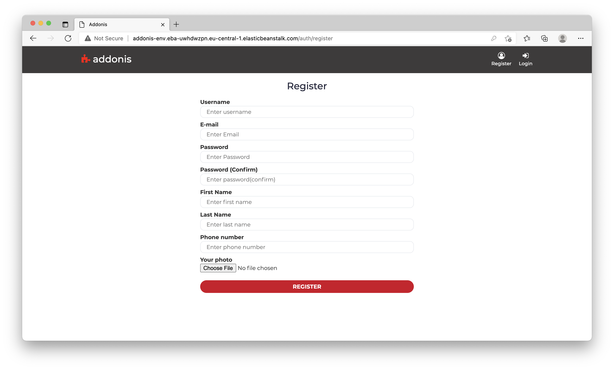

# Addonis

## Description
**Addonis** is a web application that gives users opportunity to manage add-ons. The Aplication has three types of users: 
- anonymous;
- regular;
- administrator.

Anonymous users are able to filter addons by name or IDE and sort by the name, number of downloads, upload date, last commit date. They can also download the binary content of the plugin, directly from the home page.

Registered users have private area in the web application accessible after successful login, where they could see all extensions that are owned by the currently logged user. Additionally, the registered users are able to delete, update, create their own addons and rate all addons. Once addon is created it goes in "pending" state until the administrator approves it. The extension is visible in the landing page only if it is approved.

System administrators can administer all major information objects in the system. On top of the regular user capabilities, the administrators have the following capabilities: 
- to approve new addons;
- delete or edit addons;
- block/unblock/delete user accounts.

## Built With

* [Spring](https://spring.io/) - Including Spring Web, MVC, 
* [Gradle](https://gradle.org/) - Build tool
* [Hibernate](http://hibernate.org/) - Mapping object-oriented domain model to a relational database
* [Thymeleaf](https://www.thymeleaf.org/) - Bring elegant natural templates to your development workflow
* [MariaDB](https://mariadb.com/about-us/) - Relational database management system

## Database

Website Screenshots
---

- Landing Page 

- All Addons Page
<!--  -->

- Addon Product Page

- Create new Addon form

- Update Addon form

- Login Form

- Register Form

* **Kalin Nachev** 
* **Borislav Ignatov**
* **Gabriela Georgieva**

