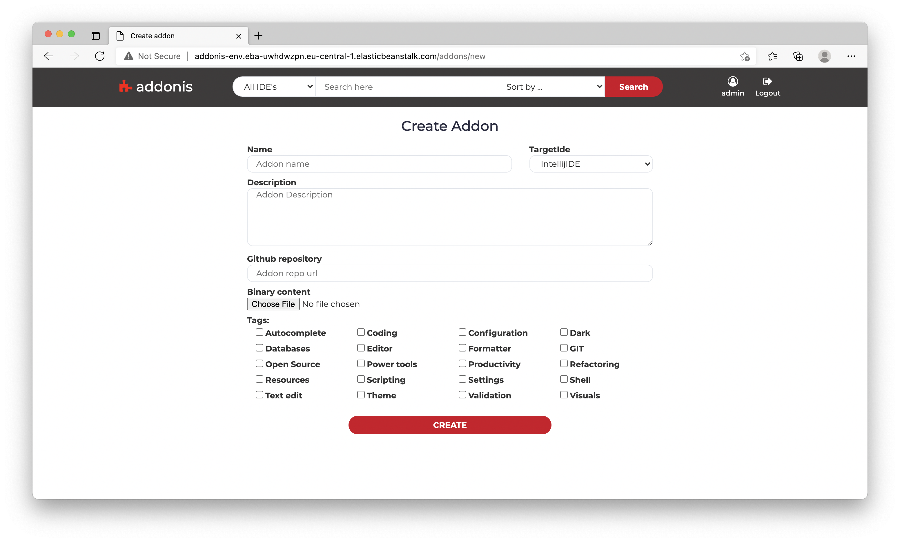

# Addonis 
Telerik Academy final project of **Gabriela Georgieva**, **Borislav Ignatov** and **Kalin Nachev**  

Addonis is a web application that allows users to download/upload/rate add-ons for various IDEs. The functionality of the application depends on the user level as described below.

**Visitors** 

Anonymous users are able to:
- Browse all approved add-ons
- Search add-ons by name or filter by IDE
- Sort add-ons by last commit date, number of downloads, upload date or name
- Download the binary content of add-on
- See register user's personal page with profile picture, name and list of their own add-ons
- Login and register

**Registered users**

After registration, the application sends email with verification link. The verification link contains unique token. When the link is clicked and followed, the application sets the status of the user, based on the token recieved, to verified. Verified users are able to:

- Update their personal data, profile picture or password
- Rate all approved add-ons
- Create/edit/delete their own add-ons. Once add-on is created it goes into "pending" state until the administrator approves it. In pending state, the add-on is visible only for the admin or its author.
- Delete their add-ons

**Admins**

On top of the regular user capabilities, the administrators have the following rights: 
- Modify featured add-ons list that is visible on the home page
- See all users, search them by phone number, username or email
- Block/unblock users. A blocked user is able to do everything as a normal user, except to create new and update current add-ons
- Update/edit/delete all add-ons
- Approve/reject pending add-ons. When add-on is approved, the application sends an notification mail to the author. If add-on is rejected - then the notification mail also contains short message from admins with the reason for rejection

## Tools & Technologies
**Spring, Hibernate, Thymeleaf, Mockito, HTML, CSS, MariaDB, Gradle, Amazon S3**

## Link to application
http://addonis-env.eba-uwhdwzpn.eu-central-1.elasticbeanstalk.com/

## Swagger API documentation
http://addonis-env.eba-uwhdwzpn.eu-central-1.elasticbeanstalk.com/swagger-ui/#/

## Website screenshots

- Home Page 

- Add-on Detailed View 

- Users page (admin view)

- Create new add-on

- Update add-on

<!-- - Login Form 
 -->

- Register Form 

## Database schema

